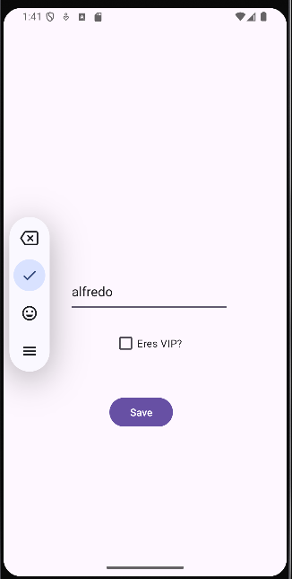
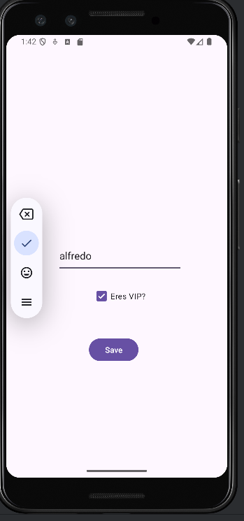
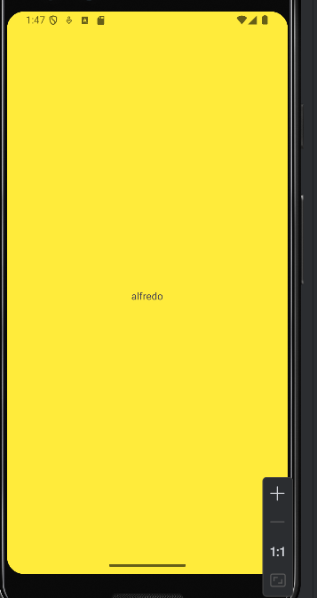
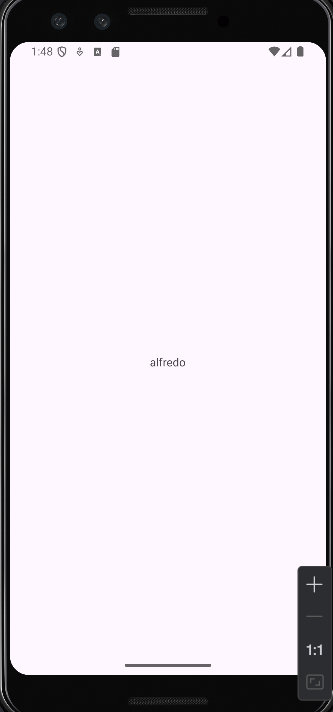

DataStore Preferences in Android

Main activity

If you select the checkBox in MainActivity and then Save

the application will show you another activity called "DetailActivity".

If the checkbox was not selected, only your name appears with a white background.
