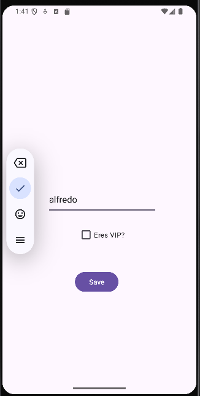
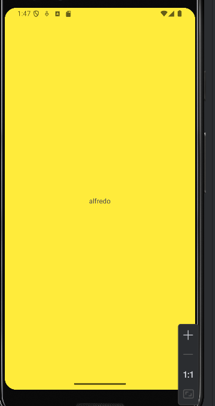

# DataStore Preferences in Android

## Main Activity

Si seleccionas el **CheckBox** en `MainActivity` y luego presionas **Save**:  

La aplicación te mostrará otra actividad llamada **"DetailActivity"**.  

Si el **CheckBox** no fue seleccionado, solo aparecerá tu nombre con un fondo blanco.  
 